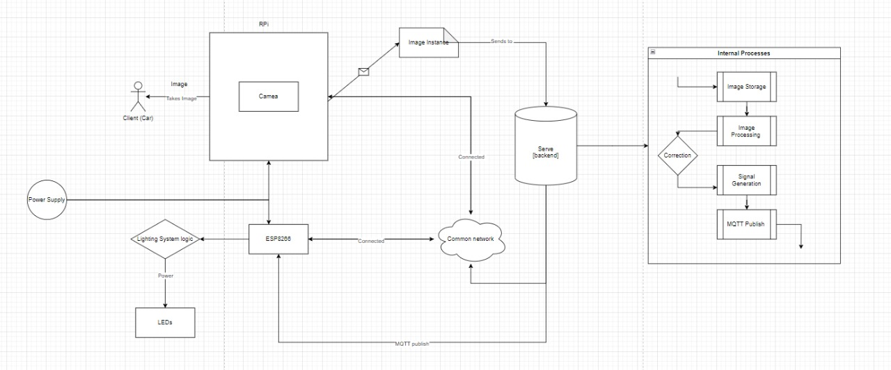

# Smart Parking System

This project is a **Smart Parking System** designed using IoT technologies, real-time object detection, and efficient communication protocols. The system aims to optimize parking space utilization, alleviate congestion, and enhance user experience in parking lots, particularly in high-traffic areas like malls and airports.

## Group Members:
- **Taksh Dhabalia** – 1032220493
- **Samanyu Bhate** – 1032220884
- **Gaganjot Kaur** – 1032222170
- **Nimisha James** – 1032222171

---

## Table of Contents
- [Smart Parking System](#smart-parking-system)
  - [Group Members:](#group-members)
  - [Table of Contents](#table-of-contents)
  - [Introduction](#introduction)
  - [Need \& Motivation](#need--motivation)
  - [Research Objective](#research-objective)
  - [Literature Review](#literature-review)
  - [Problem Description](#problem-description)
  - [Problem Approach](#problem-approach)
  - [Comparative Analysis](#comparative-analysis)
  - [Contributions and Implications](#contributions-and-implications)
  - [Future Scope](#future-scope)
  - [References](#references)
  - [Code](#code)

---

## Introduction
Urbanization and the increasing number of automobiles have led to a growing demand for parking space. Conventional parking systems suffer from inefficiencies like congestion and a lack of real-time visibility. Our **Smart Parking System** provides real-time parking availability information using IoT, automating parking guidance to reduce traffic and enhance the overall user experience.

## Need & Motivation
Urban centers are facing challenges with parking congestion and limited parking spaces. Current methods rely on manual labor, which leads to inefficiencies and monetary losses. Our motivation is to bring automation to parking management, enhancing both efficiency and user satisfaction.

## Research Objective
Our goal is to automate parking guidance through IoT and network advancements, using sensors and real-time data to help drivers find available spaces quickly, reducing stress and traffic in busy areas.

## Literature Review
1. IEEE Xplore - "A Smart Parking System Based on IoT and Machine Learning"
2. EV Charging Summit - "Wireless EV Charging"
3. MDPI Sensors - "Smart Parking Solutions Using IoT"
4. ResearchGate - "IoT-based Smart Parking System"

## Problem Description
The existing parking systems have several challenges:
- **Manual Monitoring**: Inefficient and time-consuming.
- **Limited Real-Time Data**: Increases frustration and congestion.
- **Technological Integration**: Combining hardware and software for real-time solutions is complex.
- **Communication Protocol**: Ensuring robust communication between devices using protocols like MQTT.
- **User Experience**: Enhancing user satisfaction through clear indicators and smooth navigation.

## Problem Approach
We propose the **Automated Parking Guiding Lights System**, which provides real-time guidance through the following components:
- **Raspberry Pi**: The core processor for video feed analysis.
- **CCTV Camera**: Provides video feed to detect parking spot occupancy.
- **ESP8266**: Controls LED lights based on occupancy.
- **LED Lights**: Guide drivers to available spaces.
  
**Software Components**:
- **OpenCV**: Real-time car detection from video feed.
- **MQTT Protocol**: Facilitates communication between Raspberry Pi and ESP8266.
- **Python Scripts**: Process video feed and send control signals to ESP8266.

## Comparative Analysis
| Aspect | Traditional System | Smart Parking System |
| --- | --- | --- |
| Parking Space Utilization | Manual monitoring | Real-time, dynamic guidance |
| Real-Time Availability | Absent | Available |
| Integration | Limited | IoT-based seamless integration |
| Scalability | Challenging | Modular and scalable |
| Cost | High | Cost-effective using open-source technology |

## Contributions and Implications
- **Efficiency Improvement**: Reduced search time for parking spaces.
- **User Satisfaction**: Intuitive design and real-time guidance improve the user experience.
- **Environmental Impact**: Reduced emissions from cars circling for parking.

## Future Scope
- **Integration with Autonomous Vehicles**: Allowing vehicles to automatically locate and reserve parking spots.
- **Predictive Analytics**: Using machine learning to predict parking demands.
- **Dynamic Pricing**: Optimizing revenue with real-time data.
- **AR Navigation**: Using augmented reality to guide drivers to available spots.

## References
1. MQTT Documentation
2. Raspberry Pi Documentation
3. OpenCV Documentation
4. ESP8266 Documentation

## Code
- [Camera Module](https://github.com/TakshDhabalia/Driving_Optimization/blob/YOLOv5/Camera.py)
- [Detection Module](https://github.com/TakshDhabalia/Driving_Optimization/blob/YOLOv5/Detection_Latest.py)
- [MQTT Publisher](https://github.com/TakshDhabalia/Driving_Optimization/blob/YOLOv5/MQTT.py)
- [MQTT Subscriber](https://github.com/TakshDhabalia/Driving_Optimization/blob/YOLOv5/sub_mqtt.ino)

---

**Project by**: *Taksh Dhabalia & Team*
